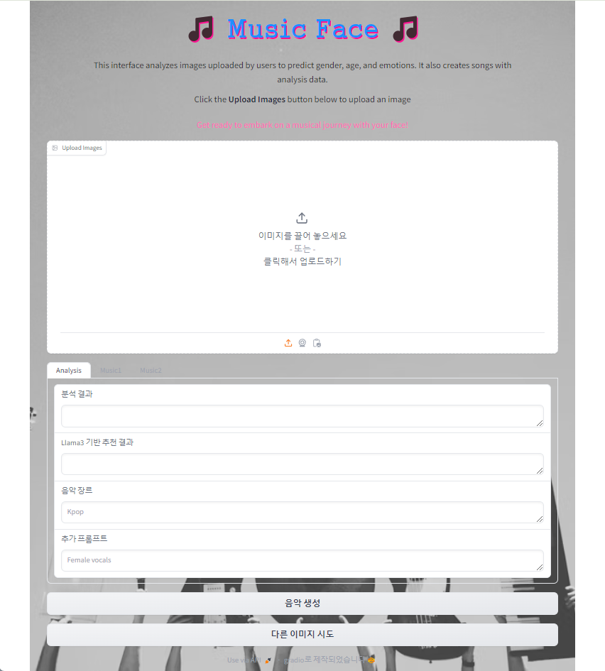
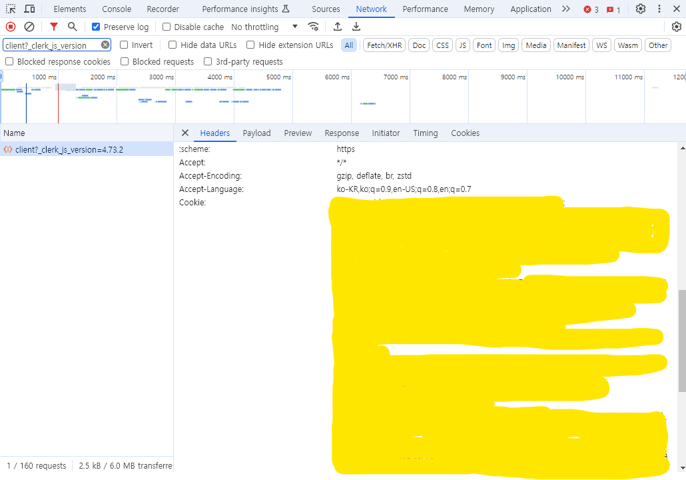

# 감정 분석 모델을 활용한 음악 생성 프로그램<br/>Music Face

## :alarm_clock: 개발 기간: 5월 9일(목) ~ 6월 4일(수)

## 개발환경:
|IDE|프로그래밍<br/>언어|
|------|---|
|||

## :people_holding_hands: 멤버구성 및 역할
김윤성: EDA, Modeling, Model ensemble, Presentation

정강빈: EDA, Modeling, preprocessing, MusicFace 개발

천진원: EDA, Modeling, crop & seg, PPT

한재현: EDA, Modeling, 서기

## :bulb: 기획 선정 및 배경
국내 우울증 환자는 꾸준히 증가하고 있습니다. 건강보험심사평가원 자료에 따르면 2022년 우울증 진단을 받은 사람은 100만명을 넘어섰고, 의료비도 증가하는 추세입니다. 이러한 추세는 개인의 건강에 영향을 미칠 뿐만 아니라 국가 전체의 경제 생산성 저하, 의료체계의 부담 증가, 다양한 사회 문제로 이어지는 중대한 과제를 제기하고 있습니다.

약물은 우울증에 대한 일반적인 치료법이지만 종종 수많은 부작용이 따릅니다. 따라서 우울증을 치료하기 위한 건강하고 비약리적인 방법을 모색하는 것이 시급히 필요합니다. 유망한 접근법 중 하나는 음악 치료입니다. 프랑스의 "Les-Fontaines-d'Ô" 재활 센터에서 실시한 연구에서는 우울증 치료에 있어 음악 치료의 상당한 효과가 입증되었습니다.

개인의 감정을 이해하고 분석하여 개인별 힐링 음악을 만들어 음악치료의 효과를 높일 수 있습니다. 본 프로젝트는 인간의 감정을 분석하여 맞춤형 치료음악을 생성하는 모델을 개발하는 것을 목표로 합니다. 각 개인에게 맞는 음악을 맞춤화함으로써 보다 효과적인 치료를 제공하고 우울증의 부담을 완화하는 데 도움을 줄 수 있습니다.

이 모델은 우울증 환자의 음악적 치료뿐만 아니라 모든 사람이 자신에게 맞는 음악을 만들고 즐길 수 있도록 설계되었습니다. 이 맞춤형 음악은 일상 생활에 즐거움을 선사하고 효율성을 향상시킬 수 있습니다. 모두를 위한 맞춤형 음악을 만들어 우울증 환자에게는 힐링을, 우울증이 없는 사람에게는 기쁨을 선사하여 국가 전체의 활력을 불어넣고, 생산성을 높이며 다양한 사회 문제를 해결하여 사회 전체에 수많은 이점을 제공할 수 있는 잠재력을 가지고 있습니다.

요약하자면, 이 프로젝트의 목표는 인간의 감정을 분석하고 맞춤형 치료 음악을 생성하는 모델을 개발하는 것입니다. 이 모델은 우울증 치료와 더불어 개인의 즐거움의 원천 역할을 하여 더 건강하고 행복하며 생산적인 사회에 기여할 것입니다.

## :thumbsup: 기존 서비스와의 차이점
기존에 있던 음악들 중에서 자신이 원하는 음악을 듣는 것과 달리 개인화된 맞춤형 음악을 제공하는 서비스로써, 개인의 감정에 효과적으로 공감하고 이해할 수 있습니다. 감정을 빠르게 치유하고 즐거움을 얻을 수 있는데 효과적으로 작용합니다.

## :robot: 모델 개발
> ### EDA
1. Json 파일을 DataFrame으로 변환 후 각종 정보를 확인했습니다.

각 이미지 데이터의 라벨링, 나이, 성별, 배경정보, Bounding Box 정보 등 각종 정보가 처리되어 있습니다.


2. 기초 통계 정보를 확인했습니다.

3. 간단한 시각화를 통해 데이터의 분포를 확인했습니다. 감정에 대한 데이터 불균형은 존재하지 않습니다.


> ### Preprocessing
1. 사진 데이터 crop & crop+seg 작업을 진행했습니다.

crop


crop & seg


2. array 변환, 차원 추가 및 resize 전처리 작업을 수행했습니다.

> ### Modeling & Model ensemble

ConvNeXt, ResNet v2, DenseNet, MobileNet v2/v3, Inception v3, BEIT, SWIN, YOLO v8 모델을 돌려보고 loss 및 acc를 측정하였고,
모델 앙상블을 진행했습니다.

모든 모델들의 loss와 acc를 측정한 결과, 단일 모델인 BEIT가 loss 0.5846, acc 87.33%로 가장 높은 성능을 보였습니다. 따라서 BEIT를 감정 분석 모델로 선정했습니다.
> ### Prerequisites

Before using the library or REST API, you must sign up on the suno.ai website and obtain your cookie as shown in this screenshot.
You can find cookie from the Web Browser's Developer Tools -> Network Tab -> Filter: _clerk_js_version

Music Face에서 사용되는 모델의 경우 용량이 큰 관계로 구글 드라이브 링크를 첨부해드립니다. Submission/Models 폴더 내에 있는 best_model.pt, swinv2_ages.pt, swinv2_gender.pt 파일을 다운받아 이용해주세요.

[Google Drive](https://drive.google.com/drive/u/0/folders/1BNF7E2JYfD7p42UU6ymU-nXpWdB1cFyD)



> ### Input your cookie 
```
cookies='Your Cookie'
```

> ### 기타
이 비공식 API는 Suno AI 서비스와 상호 작용하는 편리한 방법을 제공하지만 생성된 음악에 대한 소유권이나 권리를 주장하지 않습니다. 플랫폼을 사용할 때 Suno AI의 서비스 약관을 존중하십시오.
